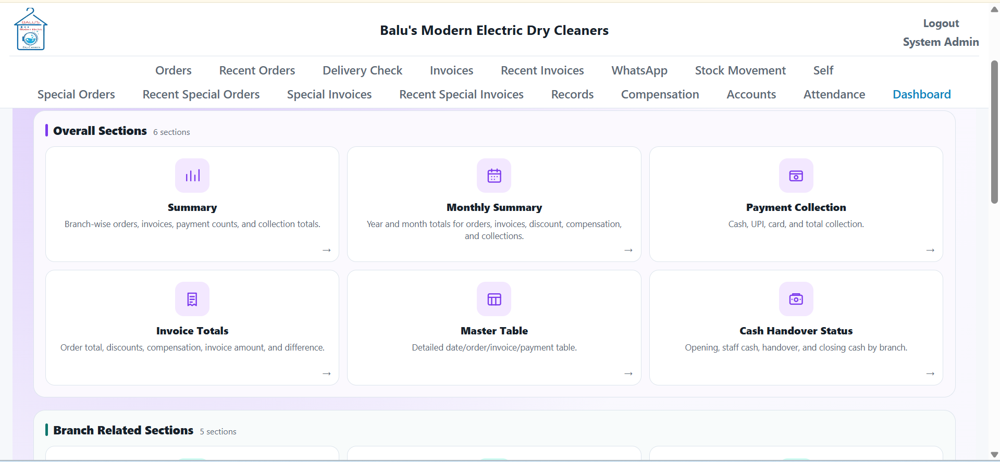
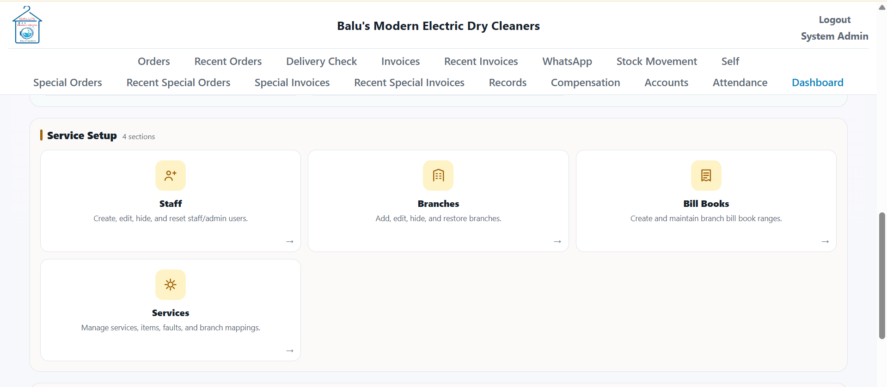
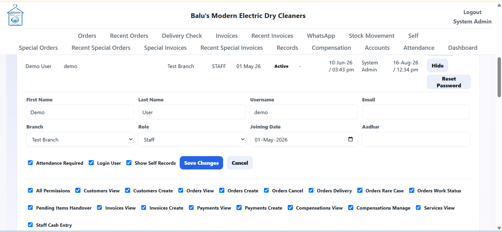
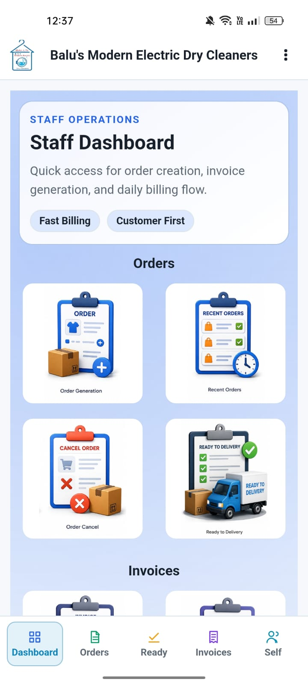
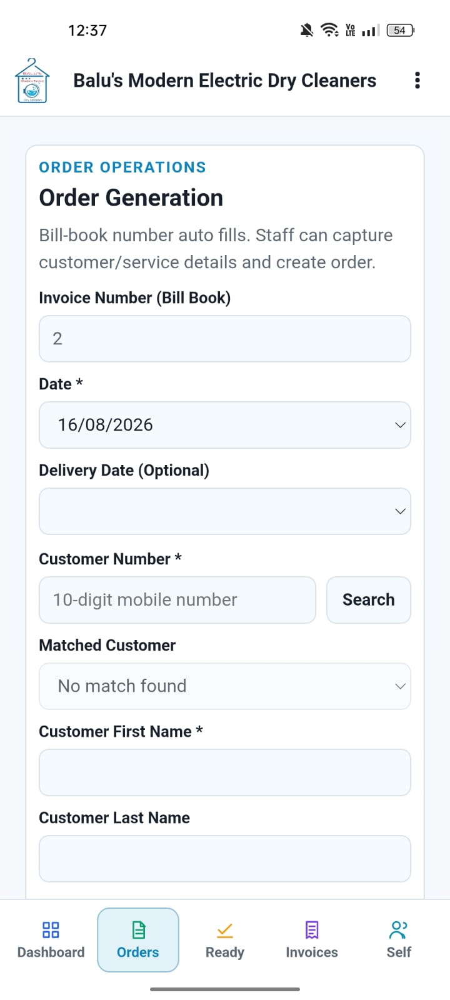
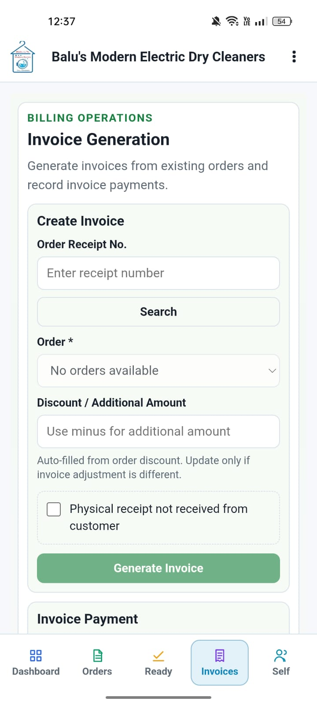
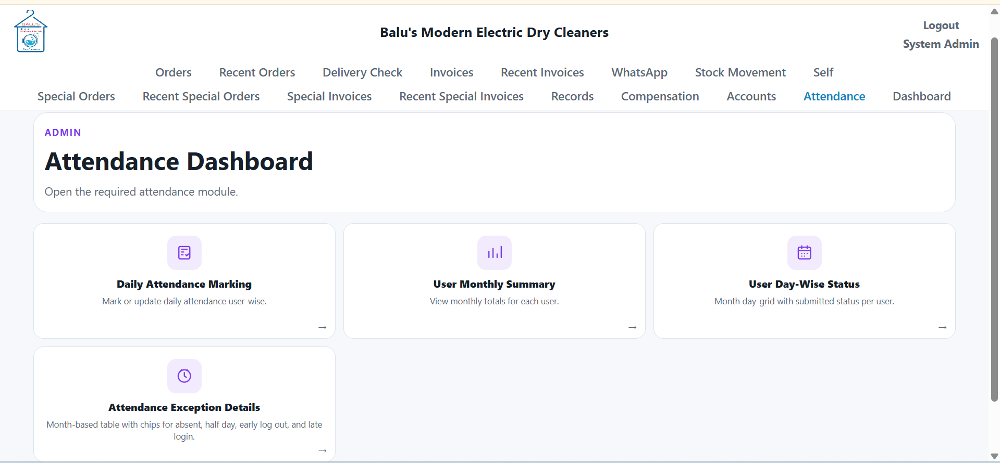

# 🧺 Laundry & Dry-Cleaning Business Management Platform

A full-stack multi-branch business management platform developed for a laundry and dry-cleaning business operating across **10 branches**, with a companion Android application.

The platform centralizes **orders, invoices, attendance, payroll, branch operations, user permissions, and WhatsApp customer communication**.

## 🚀 Key Features

* 🏢 **Multi-Branch Management**
* 👥 **Role & Permission Management**
* 🧾 **Order & Invoice Management**
* 📊 **Attendance & Payroll**
* 💬 **WhatsApp Order Notifications**
* 🤖 **WhatsApp Chatbot**
* 📱 **Android Mobile Application**
* 🔐 **Secure Authentication & Access Control**

## 🛠️ Technology Stack

| Layer            | Technology         |
| ---------------- | ------------------ |
| 🎨 Frontend      | React, TypeScript  |
| ⚙️ Backend       | FastAPI, Python    |
| 🗄️ Database     | PostgreSQL         |
| ☁️ Cloud         | AWS                |
| 📱 Mobile        | Capacitor, Android |
| 💬 Communication | WhatsApp API       |

## 🏢 Multi-Branch Operations

Designed for a business operating across **10 branches**, with controlled access to branch-specific information and centralized administration.

#### 🖼️ Screenshots




## 🔐 Authentication & Permissions

Role- and permission-based access control allows different users to access only the functionality required for their responsibilities.

#### 🖼️ Screenshot



## 🧾 Orders & Invoices

The core business workflow supports order creation, processing, status tracking, and invoice generation.

#### 🖼️ Screenshots

<div align="center">
  
  
  
</div>  

## 👥 Attendance & Payroll

The platform includes workforce management capabilities for tracking employee attendance and payroll-related information.

#### 🖼️ Screenshot



## 💬 WhatsApp Integration

Automated WhatsApp notifications keep customers informed about their orders.

A WhatsApp chatbot was also integrated for customer interaction.
<!-- 
**Screenshot:**
`assets/whatsapp-notification.png` -->

## 📱 Android Application

The web platform was extended to Android using **Capacitor**, allowing the business to access operational functionality from mobile devices.
<!-- 
**Screenshots:**

`assets/android-dashboard.png`

`assets/android-orders.png` -->

## 🏗️ Architecture

```text
                 ┌─────────────────────┐
                 │    React Web App    │
                 └──────────┬──────────┘
                            │
                            ▼
                 ┌─────────────────────┐
                 │    FastAPI REST     │
                 │        API          │
                 └──────────┬──────────┘
                            │
                            ▼
                    ┌──────────────┐
                    │  PostgreSQL  │
                    └──────────────┘
                            ▲
                            │
                 ┌──────────┴──────────┐
                 │ Capacitor Android  │
                 └─────────────────────┘

                 WhatsApp Integration
                         │
                         ▼
                      Customers
```

## 📌 Project Highlights

* 🏢 Supports **10 business branches**
* 🔐 Role- and permission-based access
* 🧾 Complete order and invoice workflow
* 👥 Attendance and payroll management
* 💬 Automated WhatsApp notifications
* 🤖 WhatsApp chatbot integration
* 📱 React web + Android application
* ⚙️ FastAPI REST backend
* 🗄️ PostgreSQL database
* ☁️ AWS cloud infrastructure

## 🔒 Project Privacy

The production application is **not publicly accessible** because it contains private business, customer, and employee information.

This repository is a **project showcase** containing sanitized screenshots and technical documentation only.
